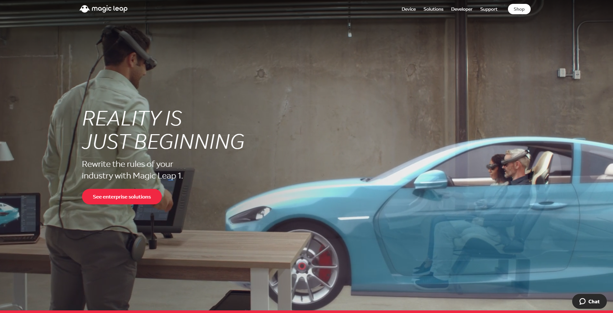
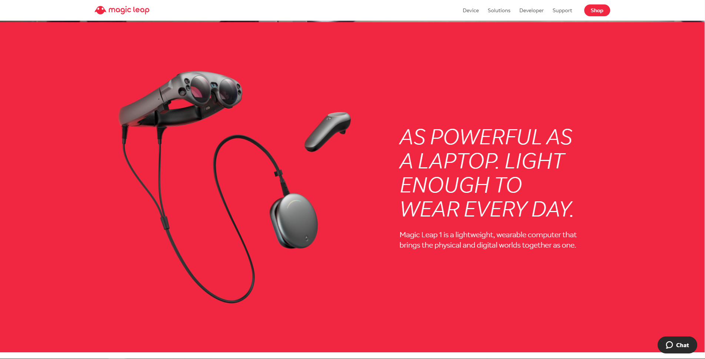
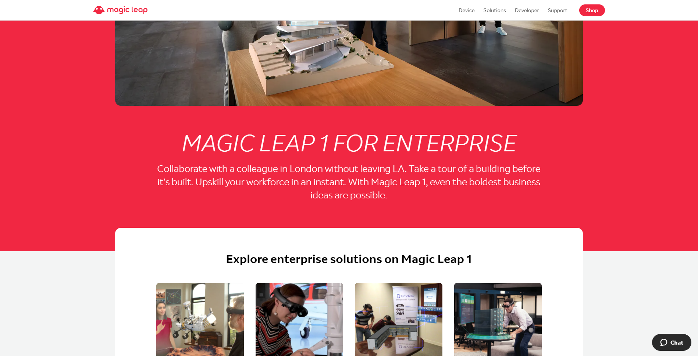
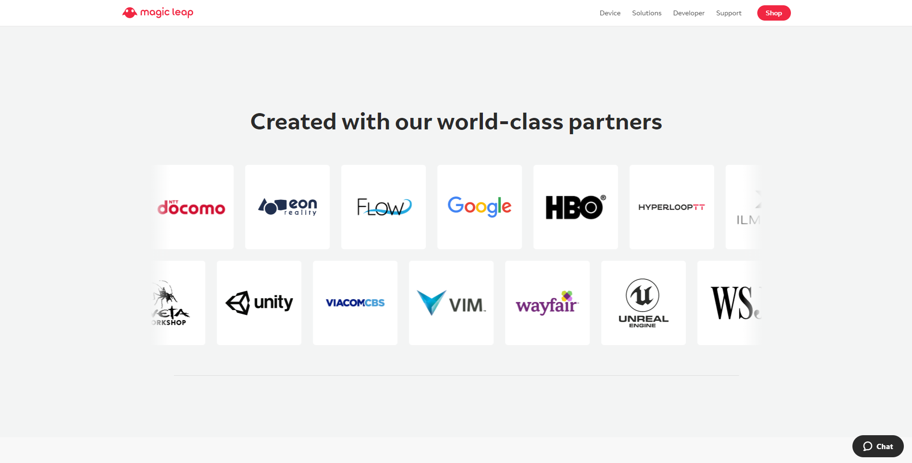
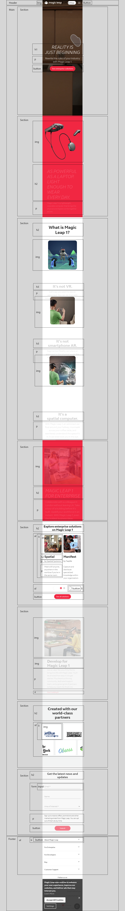

# Procesverslag
**Auteur:** Jordi Valies

## Bronnenlijst
1. -bron 1-
2. -bron 2-
3. -...-

## Eindgesprek (week 7/8)

-dit ging goed & dit was lastig-

**Screenshot(s):**

-screenshot(s) van je eindresultaat-

## Voortgang 3 (week 6)

-same as voortgang 1-

## Voortgang 2 (week 5)

-same as voortgang 1-

## Voortgang 1 (week 3)

### Stand van zaken

-dit ging goed & dit was lastig-

**Screenshot(s):**

-screenshot(s) van hoe ver je bent-

### Agenda voor meeting

-samen met je groepje opstellen-

### Verslag van meeting

-na afloop snel uitkomsten vastleggen-

## Intake (week 1)

**Mijn startniveau:** Ik ben niet perfect, na lang prutten kom ik er meestal wel uit en stiekem vind ik het best wel leuk. Daarom moet ik kiezen voor de rode pieste.

**Mijn focus:** De website die ik kies is super mooi, veel leastige CSS en JavaScript animaties. Ik kies daarom voor de bling. Responsivness is mooi meegenoemen.

**Mijn opdracht:** https://www.magicleap.com/

**Screenshots:**

**Breakdown-schets:**

